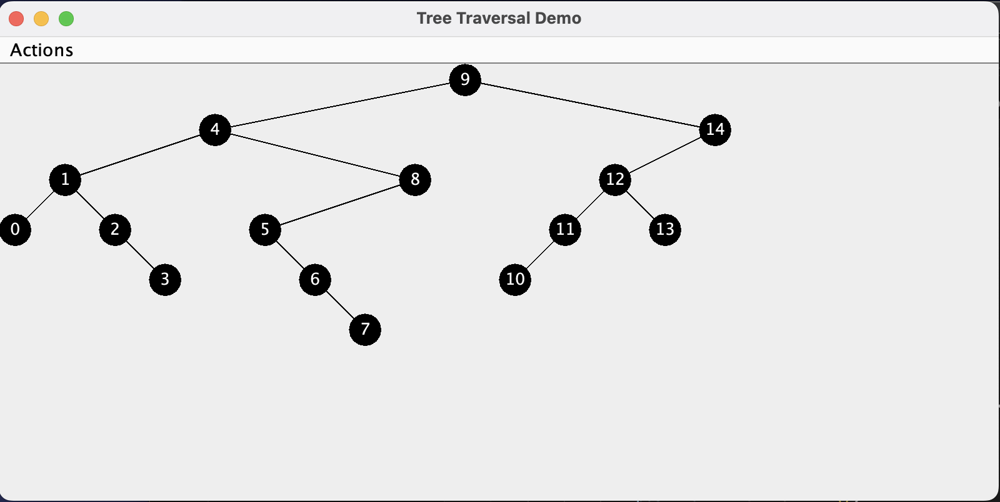

# Binary-Tree-Traversal

#### What This Program Does

This program implemetns various BST Traversal algorithms, specifically Post Order, Pre Order and In Order Traversal

* Post Order
From the root node,  we first traverse the leftmost node of the left subtree, then the right node, followed by the root of that subtree. Then, traverse the right subtree in the same manner, ending the traversal with the root node of the entire tree.

* Pre Order
From the root node, we traverse the tree by visiting the left node, traversing the left sub tree then the right node, traversing the right sub tree.

* In Order
Starting from the root, we first visit the leftmost node of the left subtree, then the right node, followed by the root of the subtree. After that, we go back to the root and then traverse the right subtree in the same manner.

#### This project demonstrates my understanding of;
1. Data Structures
2. BST Operations
3. Traversal Algorithms
4. Debugging and error handling


#### How It Works
1. Tree is built by adding nodes to the BST
2. The program performs the above mentioned operations to traverse the tree
3. There is a graphical representation of BST 

#### How to Compile and Run
1. Clone this repo

2. Compile the .java files

```javac *.java ```

3. Run the program

``` java TraversalTreeDemo ```


Example

``` 
> javac *.java 
> java TraversalTreeDemo 
```



``` 
[0,1,2,3,4,5,6,7,8,9,10,11,12,13,14]

Printing Pre Order Recursive
9, 4, 1, 0, 2, 3, 8, 5, 6, 7, 14, 12, 11, 10, 13, 
Printing Pre Order
9, 4, 1, 0, 2, 3, 8, 5, 6, 7, 14, 12, 11, 10, 13, 
Printing Post Order Recursive
0, 3, 2, 1, 7, 6, 5, 8, 4, 10, 11, 13, 12, 14, 9, 
Printing Post Order
0, 3, 2, 1, 7, 6, 5, 8, 4, 10, 11, 13, 12, 14, 9, 
 ```